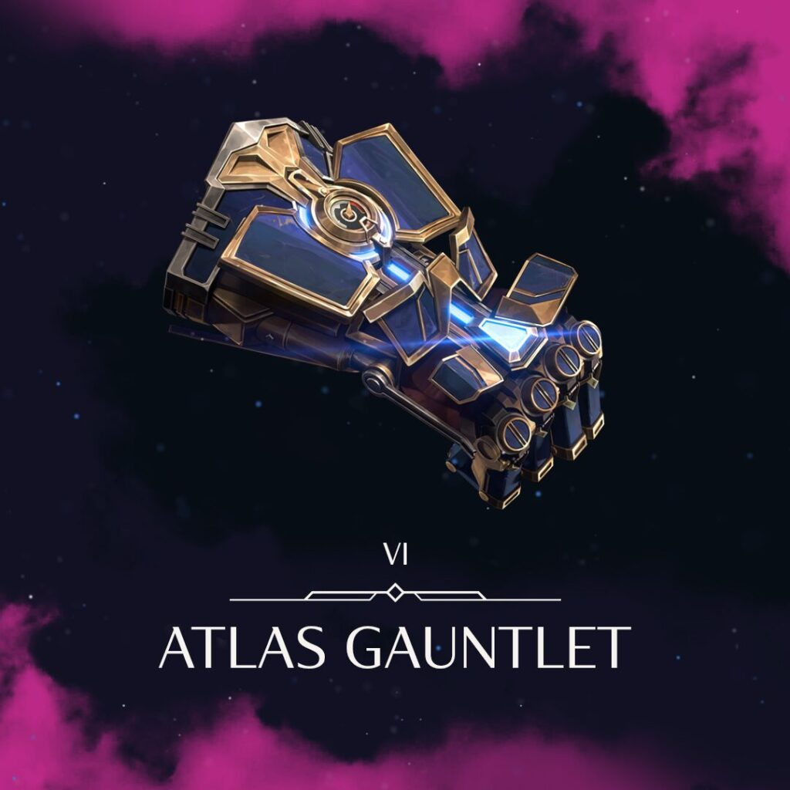
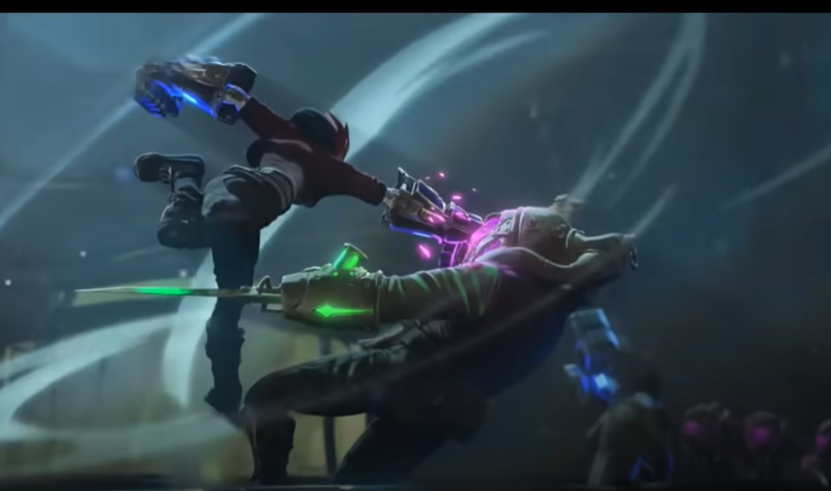
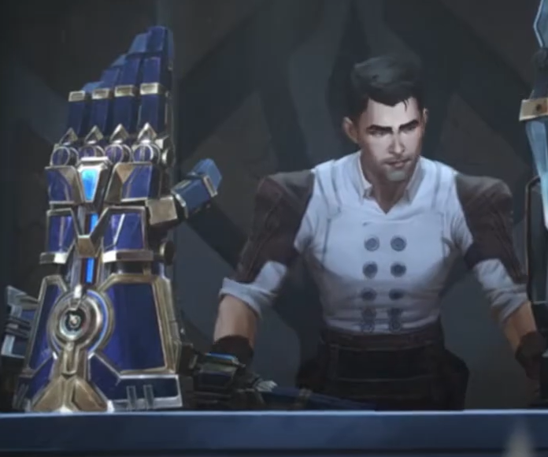
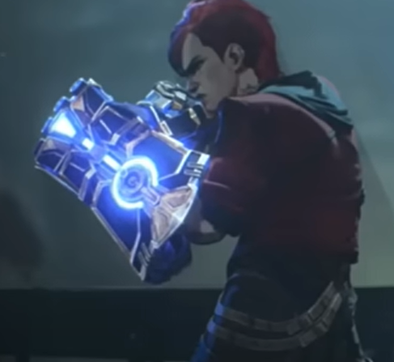

# Etude préalable pour le projet

## Atlas Gantlet

Afin de préparer au mieux le projet et ses objectifs, j'ai tout d'abord reponcé la série en *0.5 pour récupérer des images de références.

### Vision globale

*Figure 1 :* Atlas Gantlet

On peut voir un peu le détail des différentes pièces

*Figure 2 :* Vibe

** Référence taille : **

*Figure 3 :* Reference Taille par rapport à Jayce

### Détails

#### Articulations 

*Figure 4 :* Mode ON

*Figure 5 :* fight mode 

*Figure 6 :* fight mode 2

#### Fumée

**Figure 7 :** effet fumé 1

**Figure 8 :** effet fumé 2

**Figure 9 :** effet fumé 3

### Détail

**Figure 10 :** Aiguille

#### Lights

**Figure 10:** lights

---
## Recherche modèles 3D

[Texte du lien](https://sketchfab.com/3d-models/arcane-vi-gauntlet-fanart-7dc0ebd2584741f3a2eabc1929bdca8d)
Gratuit mais peu détaillé

[Texte du lien](https://www.etsy.com/fr/listing/1168945847/gantsgantelets-vis-atlas-arcane-fichiers)
23€ mais pièeces différentes 

