# Atlas Gauntlet

# Table des matières
- [Atlas Gauntlet](#atlas-gauntlet)
- [Table des matières](#table-des-matières)
  - [Gestion du projet](#gestion-du-projet)
  - [Etude préalable pour le projet](#etude-préalable-pour-le-projet)
    - [Vision globale](#vision-globale)
    - [Détails](#détails)
      - [Articulations](#articulations)
      - [Fumée](#fumée)
    - [Détail](#détail)
      - [Lights](#lights)
  - [Alimentation et Batterie](#alimentation-et-batterie)
    - [Composants et consommation](#composants-et-consommation)
    - [Courant total requis (scénario maximal)](#courant-total-requis-scénario-maximal)
    - [Puissance totale nécessaire](#puissance-totale-nécessaire)
    - [Batterie sélectionnée](#batterie-sélectionnée)
    - [Configuration choisie : 4S2P](#configuration-choisie--4s2p)
    - [Vérification des besoins en courant et puissance](#vérification-des-besoins-en-courant-et-puissance)
    - [Autonomie estimée](#autonomie-estimée)
    - [Réalisation](#réalisation)
  - [Cricuit Electrique](#cricuit-electrique)
    - [Liste composants à contrôler](#liste-composants-à-contrôler)
    - [PCB](#pcb)
      - [Schematic](#schematic)
      - [Routage](#routage)
      - [Soudure](#soudure)
  - [Modélisation 3D](#modélisation-3d)
    - [Recherche modèles 3D](#recherche-modèles-3d)
    - [Modificationd des fichiers](#modificationd-des-fichiers)
    - [3D Print](#3d-print)
  - [Code](#code)
- [Conclusion](#conclusion)

-------------------------------------------------------------
## Gestion du projet 

Mal on va pas se mentir, mais voici l'idée de base : 
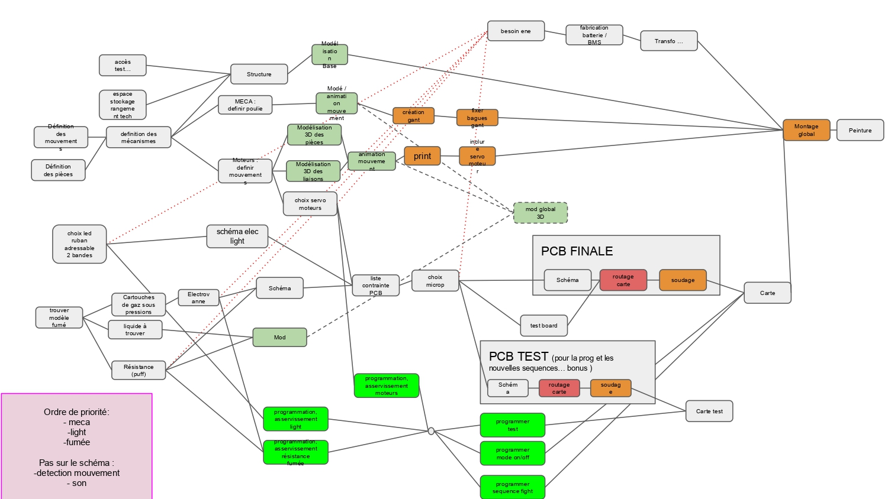  

Qui n'a a final pas vraiment ressemblé à ça...

## Etude préalable pour le projet

Afin de préparer au mieux le projet et ses objectifs, j'ai tout d'abord reponcé la série en *0.5 pour récupérer des images de références.

​Je vous invite à revoir quelques scènes pour comprendre le projet : 

[Texte du lien](https://www.youtube.com/watch?v=yBPGqcVmci8&ab_channel=Cxelja)

[Texte du lien](https://youtu.be/3JUO-idpH3s?si=jVY5BonBqE6akKVS)

### Vision globale

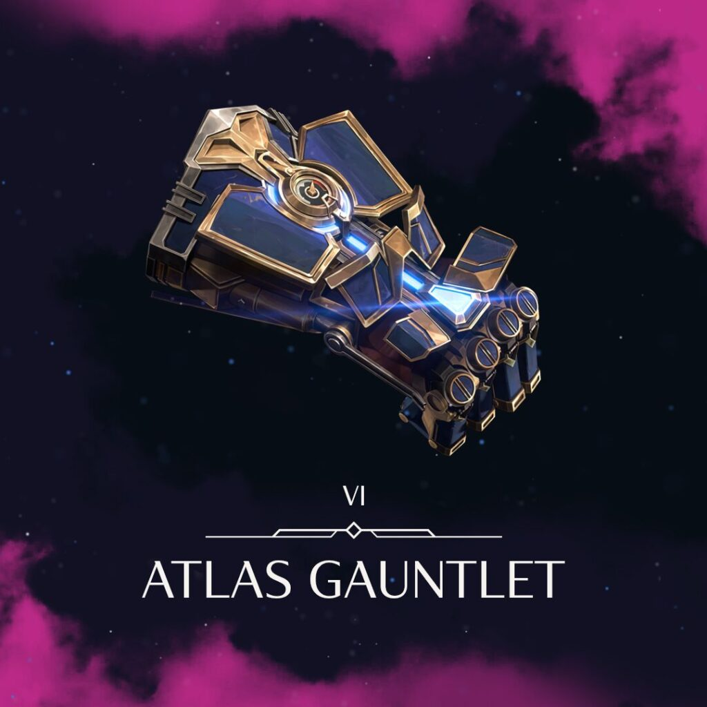  
*Figure 1 :* Atlas Gantlet

On peut voir un peu le détail des différentes pièces

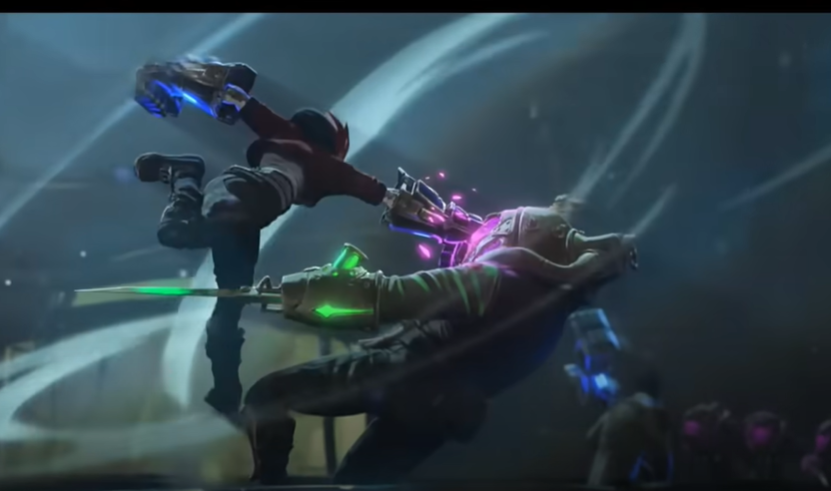  
*Figure 2 :* Vibe

**Référence taille :**

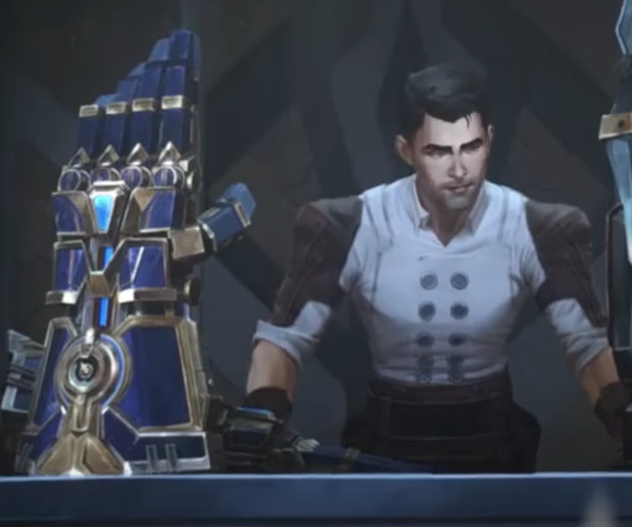  
*Figure 3 :* Reference Taille par rapport à Jayce

### Détails

#### Articulations 

  
*Figure 4 :* Mode ON

  
*Figure 5 :* fight mode 

  
*Figure 6 :* fight mode 2

#### Fumée

  
*Figure 7 :* effet fumé 1

  
*Figure 8 :* effet fumé 2

  
*Figure 9 :* effet fumé 3

### Détail

  
*Figure 10 :* Aiguille

#### Lights

  
*Figure 11 :* lights

-------------------------------------------------------------

## Alimentation et Batterie

Dans le cadre de l'option Maker, nous avons un cours sur les batteries lithium et leur fabrication à partir de cellules. 
Vous retrouverez les slides de cours dans le document lié.

Pour le projet Atlas Gauntlet, l'objectif est d'avoir une seule batterie pour alimenter l'ensemble des composants.  
Le choix final pour la batterie est une configuration 4S2P (4 cellules en série et 2 groupes en parallèle). Les détails et calculs sont expliqués ci-dessous.

### Composants et consommation

- 6 micro-servos SG90 : ~3,9 A max.  
- Ruban LED RGB (40 cm) : ~0,5 A à 5 V (si alimenté en 5 V).  
- Électrovanne : ~1 A (si alimentée en 12 V, typique).  
- Résistance chauffante : ~1,67 A (si alimentée en 12 V, 20 W).  

### Courant total requis (scénario maximal)

Si tous les composants sont activés simultanément :
- À 5 V : 3,9 A + 0,5 A = 4,4 A.
- À 12 V : 1 A + 1,67 A = 2,67 A.

### Puissance totale nécessaire

- À 5 V : 5 V × 4,4 A = 22 W.
- À 12 V : 12 V × 2,67 A = 32 W.
- Puissance totale : 22 W + 32 W = 54 W.

### Batterie sélectionnée

Nous utilisons des cellules Li-Ion 18650 INR18650-35E Samsung avec les caractéristiques suivantes :
- Tension nominale : 3,7 V.
- Capacité : 3450 mAh (3,45 Ah).
- Courant de décharge maximal : 8 A.

### Configuration choisie : 4S2P
- 4 cellules en série (4S) :  
  - Tension nominale totale : 3,7 V × 4 = 14,8 V.
  - Tension maximale (complètement chargée) : 4,2 V × 4 = 16,8 V.
  - Tension minimale (déchargée) : 3,0 V × 4 = 12,0 V.

- 2 groupes en parallèle (2P) :  
  - Capacité totale : 3,45 Ah × 2 = 6,9 Ah.
  - Courant de décharge maximal : 8 A × 2 = 16 A.

### Vérification des besoins en courant et puissance

- Courant maximal requis par le système : 4,4 A + 2,67 A = 7,07 A.  
  Le courant de décharge max de 16 A de la batterie est largement suffisant.

- Puissance maximale requise : 54 W.  
  La tension nominale de 14,8 V et un courant maximal de 16 A donnent une puissance potentielle de :  
  14,8 V × 16 A = 236,8 W, ce qui est également suffisant.

### Autonomie estimée

La capacité totale de la batterie est de 6,9 Ah.  
Pour une consommation moyenne de 7,07 A (scénario maximal) :
Autonomie = Capacité (Ah) / Courant moyen (A) = 6,9 / 7,07 ≈ 0,98 heures.  

L'autonomie estimée est d'environ 1 heure en fonctionnement continu à pleine charge.

### Réalisation

Avec une configuration 4S2P, nous obtenons une tension nominale de 14,8 V, une capacité de 6,9 Ah, et un courant maximal de 16 A, ce qui couvre largement les besoins du projet tout en offrant environ 1 heure d’autonomie à pleine charge.

J'ai donc réalisé une batterie 4S1, en rajoutant d'ailleurs quelques supports 3D pour faciliter le positionnement et améliorer la stabilité de l'ensemble. 

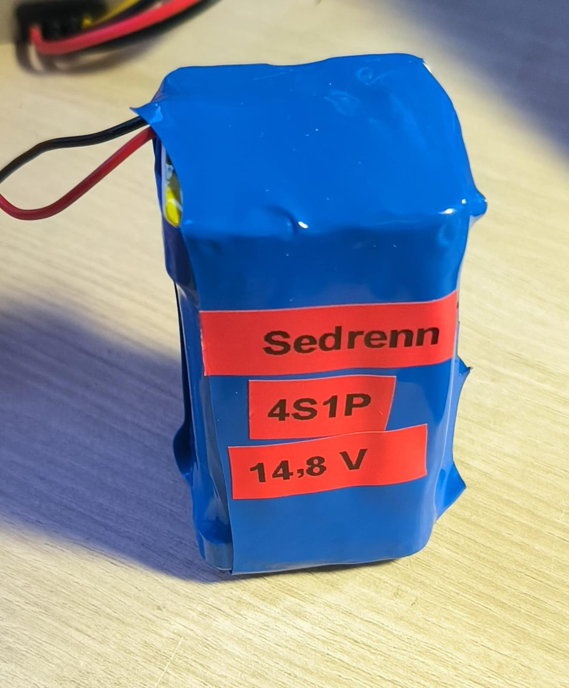  
*Figure 12 :* Batterie réalisée

Et un convertisseur a été acheté : 
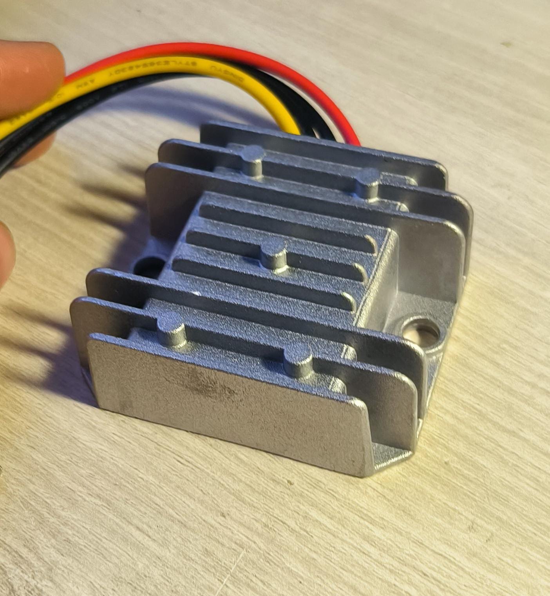  
*Convertisseur* [Lien amazon](https://www.amazon.fr/Convertisseur-tension-r%C3%A9gulation-conversion-puissance/dp/B08JGNR7L2?crid=1WF2ZT0SSQY86&dib=eyJ2IjoiMSJ9.rS_ga4-Ee5iVFPUHAvr1njx-i4-x1dtWgwA_iZwfxaN2XUr4HA0NZ0xZkvv9Uih4yeTpIh7wQJpfckXYld9dyTwLI_6hz4eOESgRT2Dwfqj9Gg0nWoq0fhNW9aZX27KBknP_jebW9CL2ABgAJh4spUd0hoMzrN_bvAoWbl5SV9tgIeU6HFhQinB7ZjvHqLXJSLTchrR-_OC4rNvwYrvVD7XU04MdoAOH9jLF5XkV5PMktwHYfE7PqxZaXCbX4fvK0Zdz5ozdDJk1C_xvHXt_6LKR_KxPiS9pxNKOhbPbFjysDkmahYLo3rbUrykul859WPJwE60sKFyMalYgMioFs1vjJG_ojZ_T2a6y2ieJNNg.uWb5HO6OvHEomE17_HAfUoJ2itVqoLq53FUICVXuOuc&dib_tag=se&keywords=Dc-DC+convertisseur+5V+10A&qid=1742469051&s=electronics&sprefix=dc-dc+convertisseur+5v+10a%2Celectronics%2C58&sr=1-9)

------

## Cricuit Electrique

A ce stade du projet, les attentes ont été revues à la baisse j'ai essayé de me reconcentrée sur les mouvements et la lumière, éliminant la fumée par exemple.

### Liste composants à contrôler 

- 5 micro-servos SG90 
- Ruban LED RGB [Lien amazon](https://www.amazon.fr/Jun-Saxifragelec-lumineuse-flexible-adressable-individuellement/dp/B0B8N4V9HW/ref=sr_1_41?__mk_fr_FR=%C3%85M%C3%85%C5%BD%C3%95%C3%91&crid=32YQIRETZ7MI1&dib=eyJ2IjoiMSJ9.aN30nEfhEt8ZjY0om-qhduVSRYui0Gc2tUrlifq7DtUeTCtYgnhJIhEbYTRG998c8jQY6sp44z5z7KeM82GKqMuN8UITRPoa3qSrqqDWOzjJS8FN4kL7Rc3hrl__kDHveYZWICp9XydJfon1RX3iqtTE1nTg6JDpJ5FExexWqYQZ2OtRjedm2r76zBHS2z6xavAMyDQGqm95En4FQFe2kCFTTAdkBbtVgJ1c2EZxKDlUVYxjbxegbvS1zCEEqmfl4dQ5SHuB0FQALXEXj2Da65iGZr64padNsoFQrNQQVMTC2_ZJDYlt7bUT8KH7y47AthcqXnGqhsW-5n2FK2BS0CiKSrT7QCMo1URINZxg3Ie4S0LO5Bg5tMWRnzdQtXDyy4GFBT1RvamcBfTDFc_hEze0b0V4_9HU2wnnyicLqOvX9prv2rkKeLM4hfZalUkL.wiFSjK9w8zxxHMCZwr3MC8YBHRwsM8LLTt1STBDB44g&dib_tag=se&keywords=LED%2Belectronique%2Bruban&qid=1742199857&sprefix=led%2Belectronique%2Bruban%2Caps%2C125&sr=8-41&th=1)
  
  

### PCB 

J'ai donc réalisé une PCB avec ces contraintes. 
Vous trouverez la carte dans le dossier suivant : 
[PCB](../Hardware/PCB_Atlas_Gauntlet)

#### Schematic

On est sur une carte vraiment simple, avec juste des connecteurs.
Je suis restée sur une deux couches, il n'y avait pas besoin de plus sincèrement.

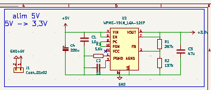  
*Schematic Alimentation* 

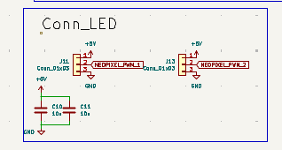  
*Schematic connecteurs LED* 

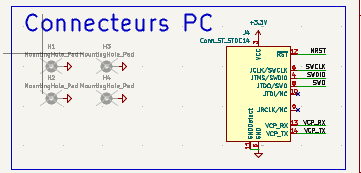  
*Schematic connecteurs PCB* 

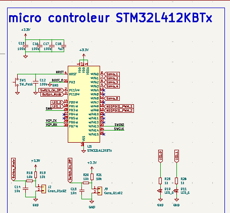  
*Schematic micro Controleur* 

#### Routage 
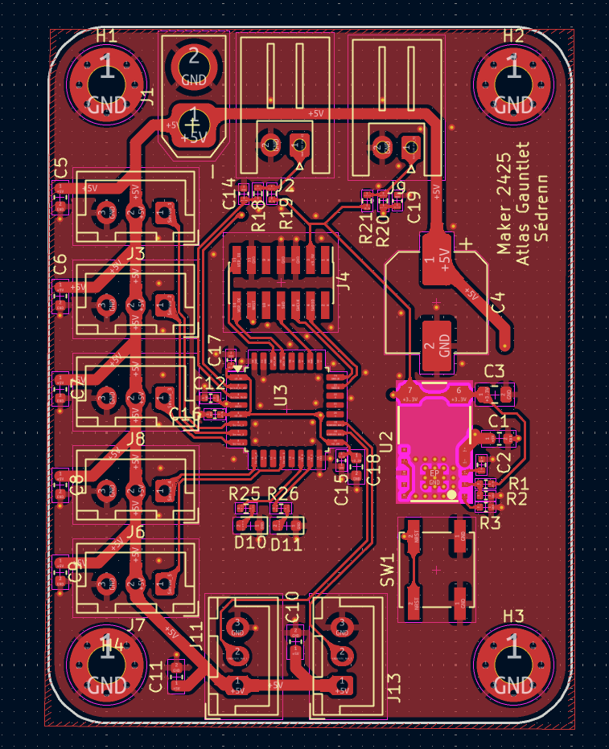  
*Routage Top Layer* 

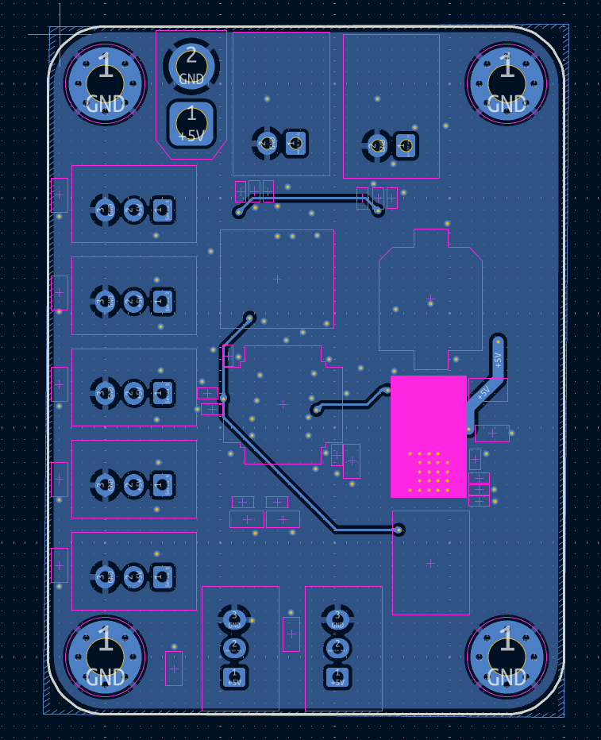  
*Routage Back Layer* 

#### Soudure

Une fois recu j'ai pu souder les différents composants nécessaires pour la carte.

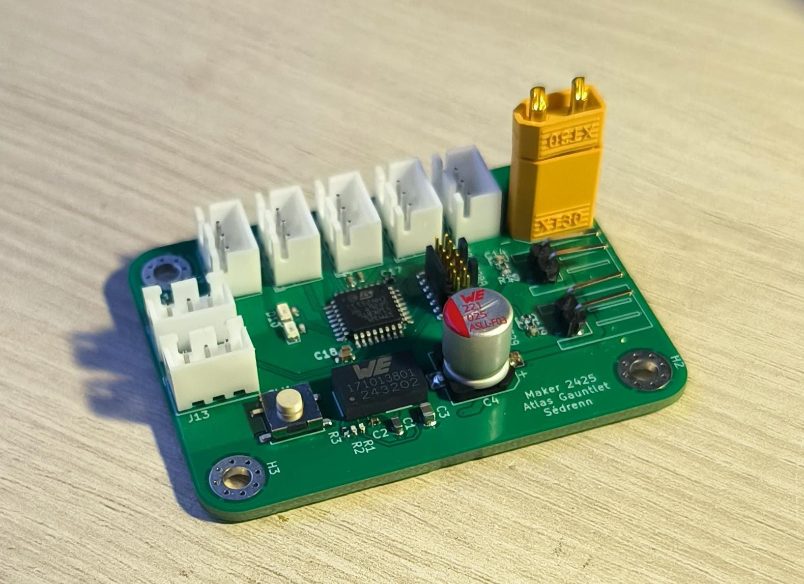  
*Routage Back Layer* 

Manque de temps, de moyens et de compétences (attention cette phrase sera récurrente à partir d'ici). Je n'ai pas pu la tester. 

Bon j'avais quand même pu faire les câbles de conneciton en amont : 
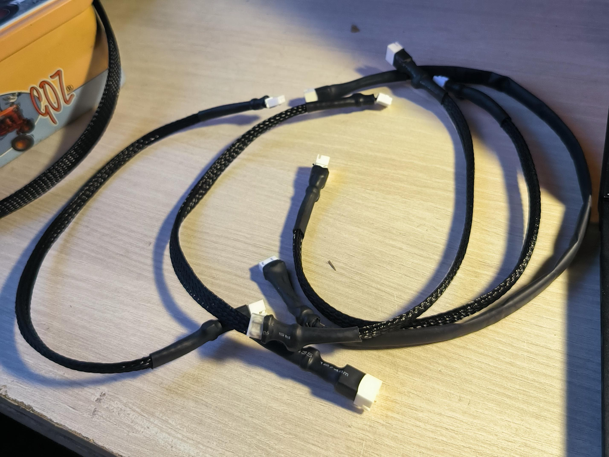  
*cables* 

----
## Modélisation 3D

Grosse partie, première tentative de modélisation seule.
Manque de temps, de moyens et de compétences, j'ai pris la décision de trouver un modèle sur internet. 

### Recherche modèles 3D

[Texte du lien](https://sketchfab.com/3d-models/arcane-vi-gauntlet-fanart-7dc0ebd2584741f3a2eabc1929bdca8d)  
Gratuit mais peu détaillé

[Texte du lien](https://www.etsy.com/fr/listing/1168945847/gantsgantelets-vis-atlas-arcane-fichiers)  
23€ mais pièces différentes choix final 

Vous trouverez les différentes pièces et leurs modèles convertis en STEP ici : 
[3D](../Hardware/3D)

S'il vous plait ne les utilisez pas. Il sont la propriété de la créatrice de ce modèle. Vous pouvez les acheter. 

### Modificationd des fichiers

Pour répondre aux contraintes de mon projet j'ai du modifier les pièces pour permettre de nouveaux mouvements. Le tout sur OnShape

Manque de temps, de moyens et de compétences je n'ai pas grandement avancé dessus. 

Vous pourrez retrouver les différentes pièces modifiées dans le dossier suivant : [3D Modifié](../Hardware/3D/modified)

### 3D Print

Les pièces ont été imprimées sur les bambulab de l'école.

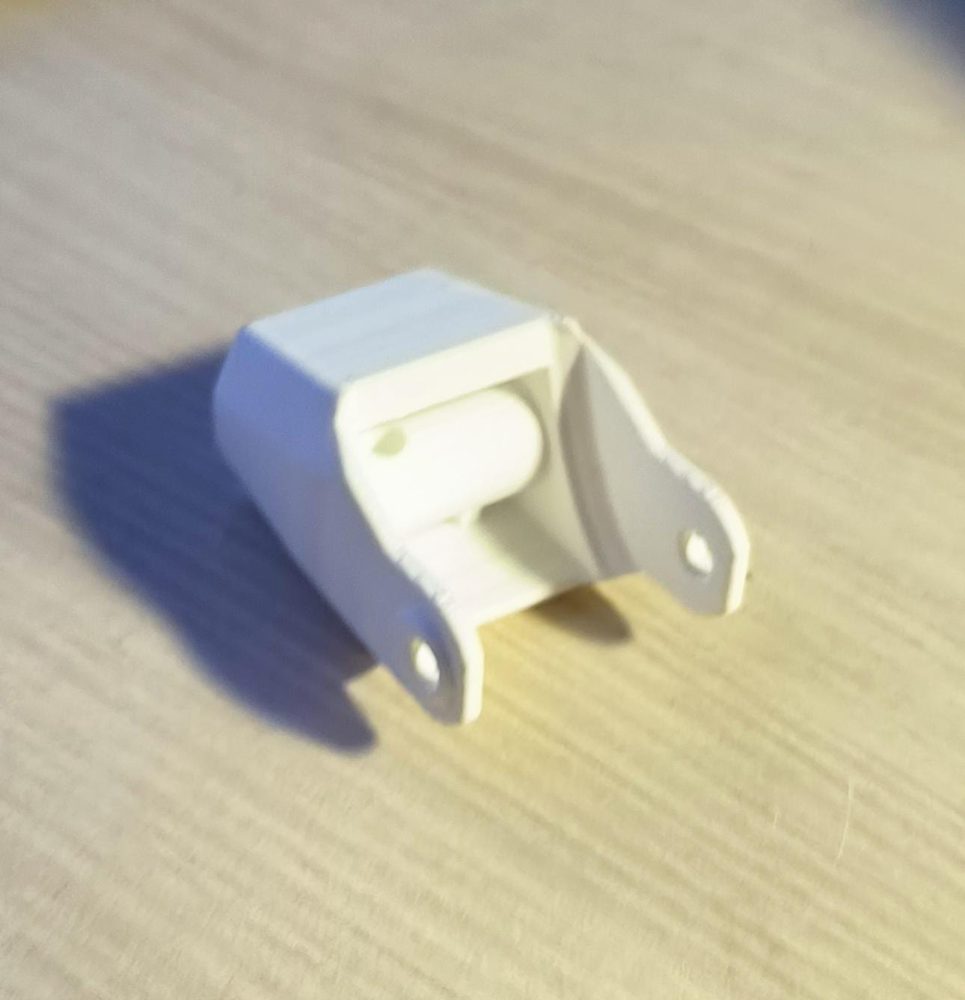  
*Routage phalange_1*

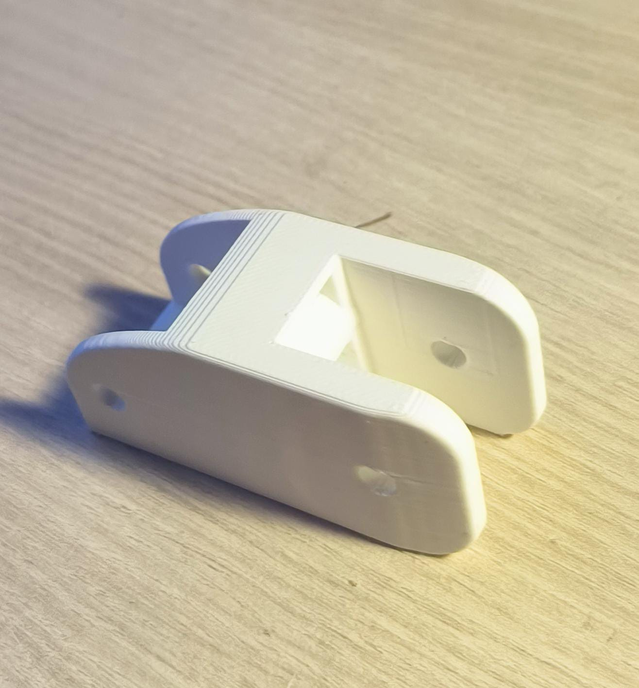  
*Routage phalange_2*

Celle ci a été imprimée à la Casemate, fab labn de Grenoble qui a bien voulu m'acceuillir. Elle est sensée acceuillir un tube de PVC 3.2 pour servir de poignée. Choix fait pour diminuer le temps d'impression sue la Prusa (17h déjà)

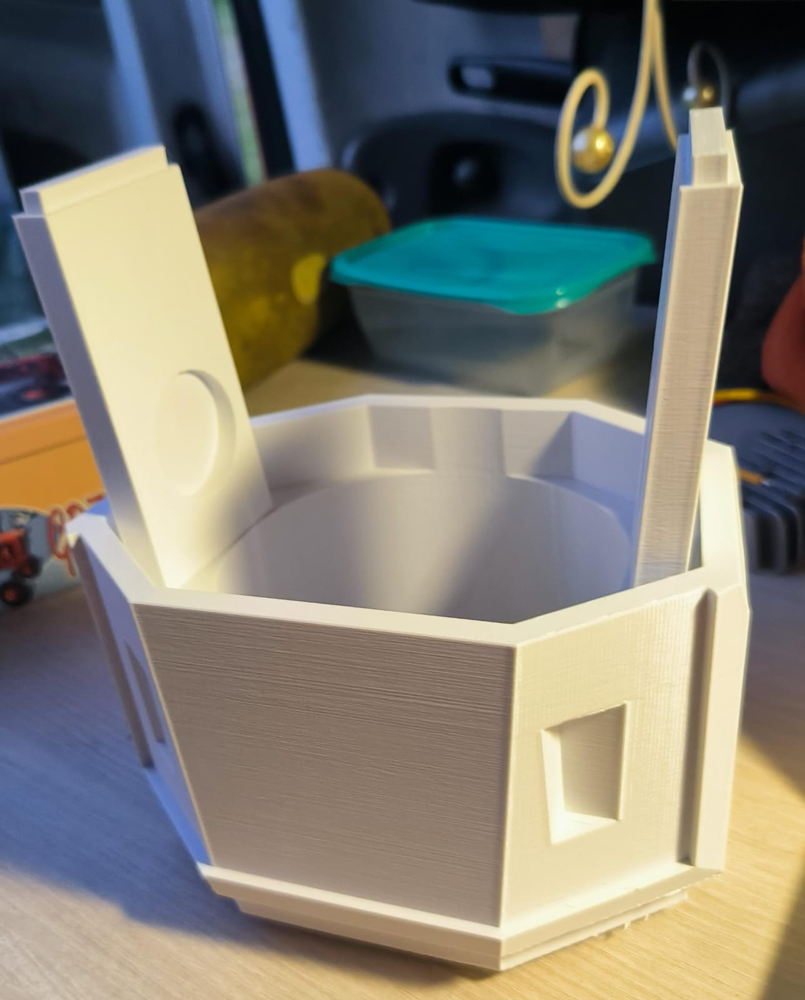  
*Routage main*

-----
## Code 
 
Manque de temps, de moyens et de compétences... Je n'ai factuellement rien écrit comme code pour ce projet. 

J'ai utilisé cube IDE au début pour pouvoir faire la schématique de ma carte. 
Mais sans plus.

Vous trouverez néanmoins le début de ce projet ici : [code](../software/CubeIDE/Atlas_Gauntler)

-----
# Conclusion 

Un résumé ? 
Manque de temps, de moyens et de compétences.

Projet encore une fois beaucoup trop ambitieux. Et je n'ai pas eu l'énergie etc de le pousser vers quoi il aurait pu être...

Donc on range tout ca bien dans un tiroir pour le ressortir facilement dès qu'on pourra. 

Pour plus d'informations je vous invite à consulter la vidéo associée au projet : [Texte du lien](TO ADD)

Ainsi que le lien vers le site de l'option maker : 
[Texte du lien](https://maker.coventgarden.fr/project/12/)
[code](site_html/Maker%20-%20Dashboard.html)

Merci pour votre lecture