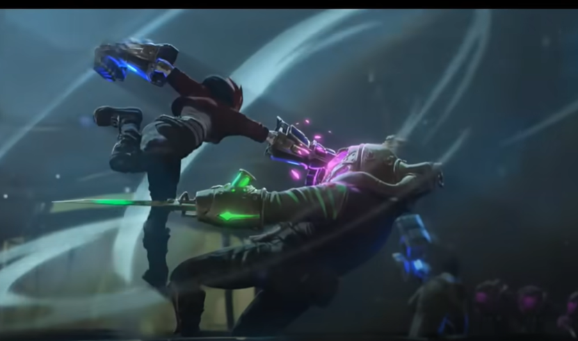

# Atlas Gauntlet

# Table des matières
- [Etude préalable pour le projet](#etude-préalable-pour-le-projet)
  - [Vision globale](#vision-globale)
  - [Détails](#détails)
  - [Recherche modèles 3D](#recherche-modèles-3D)
- [Alimentation et Batterie](#alimentation-et-batterie)
  - [Composants et consommation](#composants-et-consommation)
  - [Batterie sélectionnée](#batterie-sélectionnée)

-------------------------------------------------------------
 
## Etude préalable pour le projet

Afin de préparer au mieux le projet et ses objectifs, j'ai tout d'abord reponcé la série en *0.5 pour récupérer des images de références.

### Vision globale

  
*Figure 1 :* Atlas Gantlet

On peut voir un peu le détail des différentes pièces

  
*Figure 2 :* Vibe

**Référence taille :**

  
*Figure 3 :* Reference Taille par rapport à Jayce

### Détails

#### Articulations 

  
*Figure 4 :* Mode ON

  
*Figure 5 :* fight mode 

  
*Figure 6 :* fight mode 2

#### Fumée

  
*Figure 7 :* effet fumé 1

  
*Figure 8 :* effet fumé 2

  
*Figure 9 :* effet fumé 3

### Détail

  
*Figure 10 :* Aiguille

#### Lights

  
*Figure 11 :* lights

---

## Recherche modèles 3D

[Texte du lien](https://sketchfab.com/3d-models/arcane-vi-gauntlet-fanart-7dc0ebd2584741f3a2eabc1929bdca8d)  
Gratuit mais peu détaillé

[Texte du lien](https://www.etsy.com/fr/listing/1168945847/gantsgantelets-vis-atlas-arcane-fichiers)  
23€ mais pièces différentes

-------------------------------------------------------------

## Alimentation et Batterie

Dans le cadre de l'option Maker, nous avons un cours sur les batteries lithium et leur fabrication à partir de cellules. 
Vous retrouverez les slides de cours dans le document lié.

Pour le projet Atlas Gauntlet, l'objectif est d'avoir une seule batterie pour alimenter l'ensemble des composants.  
Le choix final pour la batterie est une configuration 4S2P (4 cellules en série et 2 groupes en parallèle). Les détails et calculs sont expliqués ci-dessous.

---

### Composants et consommation

- 6 micro-servos SG90 : ~3,9 A max.  
- Ruban LED RGB (40 cm) : ~0,5 A à 5 V (si alimenté en 5 V).  
- Électrovanne : ~1 A (si alimentée en 12 V, typique).  
- Résistance chauffante : ~1,67 A (si alimentée en 12 V, 20 W).  

---

### Courant total requis (scénario maximal)

Si tous les composants sont activés simultanément :
- À 5 V : 3,9 A + 0,5 A = 4,4 A.
- À 12 V : 1 A + 1,67 A = 2,67 A.

---

### Puissance totale nécessaire

- À 5 V : 5 V × 4,4 A = 22 W.
- À 12 V : 12 V × 2,67 A = 32 W.
- Puissance totale : 22 W + 32 W = 54 W.

---

### Batterie sélectionnée

Nous utilisons des cellules Li-Ion 18650 INR18650-35E Samsung avec les caractéristiques suivantes :
- Tension nominale : 3,7 V.
- Capacité : 3450 mAh (3,45 Ah).
- Courant de décharge maximal : 8 A.

### Configuration choisie : 4S2P
- 4 cellules en série (4S) :  
  - Tension nominale totale : 3,7 V × 4 = 14,8 V.
  - Tension maximale (complètement chargée) : 4,2 V × 4 = 16,8 V.
  - Tension minimale (déchargée) : 3,0 V × 4 = 12,0 V.

- 2 groupes en parallèle (2P) :  
  - Capacité totale : 3,45 Ah × 2 = 6,9 Ah.
  - Courant de décharge maximal : 8 A × 2 = 16 A.

---

### Vérification des besoins en courant et puissance

- Courant maximal requis par le système : 4,4 A + 2,67 A = 7,07 A.  
  Le courant de décharge max de 16 A de la batterie est largement suffisant.

- Puissance maximale requise : 54 W.  
  La tension nominale de 14,8 V et un courant maximal de 16 A donnent une puissance potentielle de :  
  14,8 V × 16 A = 236,8 W, ce qui est également suffisant.

---

### Autonomie estimée

La capacité totale de la batterie est de 6,9 Ah.  
Pour une consommation moyenne de 7,07 A (scénario maximal) :
Autonomie = Capacité (Ah) / Courant moyen (A) = 6,9 / 7,07 ≈ 0,98 heures.  

L'autonomie estimée est d'environ 1 heure en fonctionnement continu à pleine charge.

---

## Conclusion
Avec une configuration 4S2P, nous obtenons une tension nominale de 14,8 V, une capacité de 6,9 Ah, et un courant maximal de 16 A, ce qui couvre largement les besoins du projet tout en offrant environ 1 heure d’autonomie à pleine charge.
